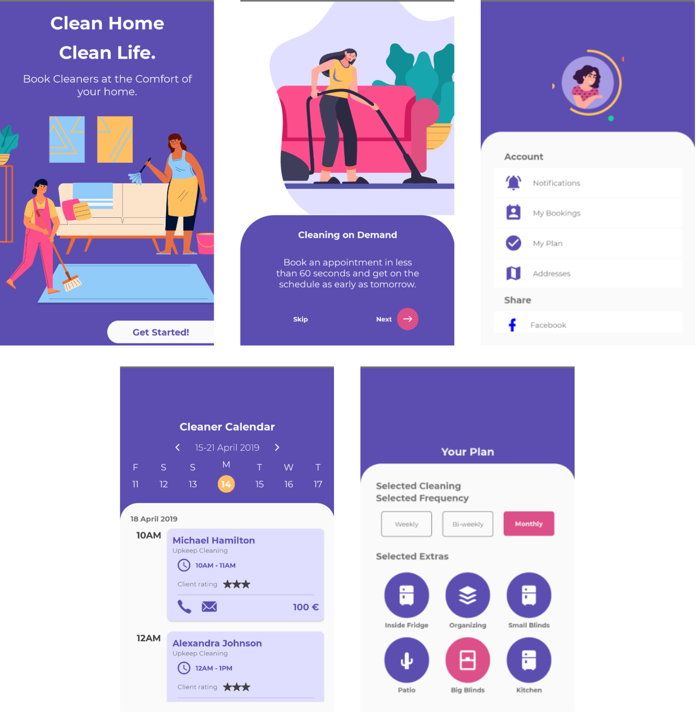

# DribbbleToReact

This is a personal collection of Pinterest / Dribble projects implemented using ReactJS & React-Native for learning purposes and skills improvement. Each one of the examples are based on a custom React boilerplate with some custome components for simplifying development process:

**NOTE:** Project Name contains a link to original Pinterest /  Dribbble project ("All rights reserved to the author of original article")

| Project Name                                                            | Description                                                                                                                                                   | Preview                                | Notes |
| ----------------------------------------------------------------------- | ------------------------------------------------------------------------------------------------------------------------------------------------------------- | -------------------------------------- | ----- |
| [Home Cleaning](https://dribbble.com/shots/10042940-Easy-Home-Cleaning) | This is an mobile application for scheduling Home Cleaning Tasks to people who provide. Can preview day schedule and timetable, create new task request, etc. |  |
|                                                                         |                                                                                                                                                               |                                        |       |